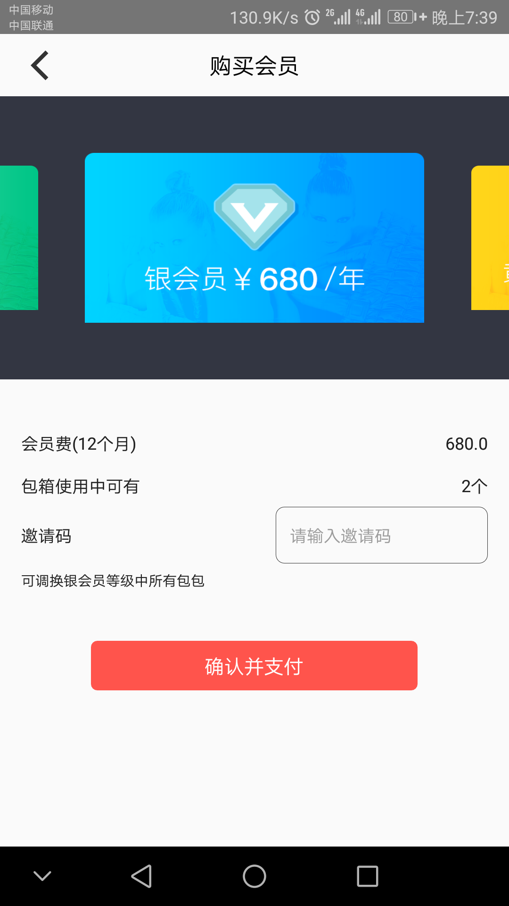

## 用原生Viewpager实现类似魅族广告图效果

[TOC]

先上效果图:

 

使用原生ViewPager很容易实现上述效果.

布局代码:

~~~~xml
<FrameLayout
        android:layout_width="match_parent"
        android:layout_height="200dp"
        android:layout_centerInParent="true"
        android:background="@color/card_bg"
        android:clipChildren="false"
        >

        <android.support.v4.view.ViewPager
            android:id="@+id/vp_become_member"
            android:layout_width="match_parent"
            android:layout_height="120dp"
            android:layout_gravity="center"
            android:layout_marginLeft="60dp"
            android:layout_marginRight="60dp"
            android:clipChildren="false"
            />

    </FrameLayout>
~~~~

ViewPager是设置中间的那个item的宽高,以及中间的item距离左边界和右边界的距离.

再看逻辑代码:

~~~~java
 /**
     * 初始化会员卡片
     */
    private void initBannar() {
        mViewPager.setPageMargin(100);//设置page间间距，自行根据需求设置
        mViewPager.setOffscreenPageLimit(5);//>=3
        mViewPager.setAdapter(new PagerAdapter() {
            @Override
            public int getCount() {
                return mMemberData.size();
            }

            @Override
            public boolean isViewFromObject(View view, Object object) {
                return view == object;
            }

            @Override
            public Object instantiateItem(ViewGroup container, int position) {
                //加载图片
                ImageView view = new ImageView(BecomeMemberTwoActivity.this);
                view.setScaleType(ImageView.ScaleType.FIT_XY);
                Glide.with(BecomeMemberTwoActivity.this).load(mMemberData.get(position).getIcon()).into(view);
                container.addView(view);
                return view;
            }

            @Override
            public void destroyItem(ViewGroup container, int position, Object object) {
                container.removeView((View) object);
            }
        });

        //setPageTransformer 决定动画效果
        mViewPager.setPageTransformer(true, new ScaleInTransformer());

    }
~~~~

但是这样写，会导致中间item的两侧，两个显示出一半的item左右滑动不了，只有在中间item上边可以左右滑动，解决方案如下：

~~~xml
<FrameLayout
        android:layout_width="match_parent"
        android:layout_height="200dp"
        android:layout_centerInParent="true"
        android:background="@color/card_bg"
        android:clipChildren="false"
        >

        <android.support.v4.view.ViewPager
            android:id="@+id/vp_become_member"
            android:layout_width="match_parent"
            android:layout_height="120dp"
            android:layout_gravity="center"
            android:paddingLeft="60dp"
            android:paddingRight="60dp"
            android:clipToPadding="false"
            />

    </FrameLayout>
~~~

