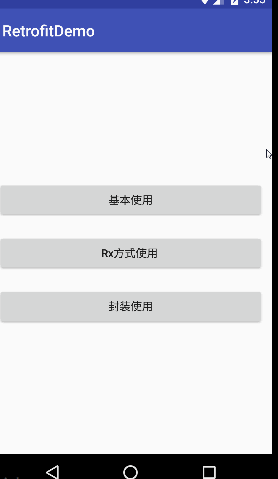

### 监听返回键和多任务键,以及屏蔽返回键

[TOC]

效果:

   

#### 首先,监听home键和多任务键

新建广播

~~~~java
public class InnerRecevier extends BroadcastReceiver {

    final String SYSTEM_DIALOG_REASON_KEY = "reason";

    final String SYSTEM_DIALOG_REASON_RECENT_APPS = "recentapps";

    final String SYSTEM_DIALOG_REASON_HOME_KEY = "homekey";

    @Override
    public void onReceive(Context context, Intent intent) {
        String action = intent.getAction();
        if (Intent.ACTION_CLOSE_SYSTEM_DIALOGS.equals(action)) {
            String reason = intent.getStringExtra(SYSTEM_DIALOG_REASON_KEY);
            if (reason != null) {
                if (reason.equals(SYSTEM_DIALOG_REASON_HOME_KEY)) {
                    Toast.makeText(context, "Home键被监听", Toast.LENGTH_SHORT).show();
                } else if (reason.equals(SYSTEM_DIALOG_REASON_RECENT_APPS)) {
                    Toast.makeText(context, "多任务键被监听", Toast.LENGTH_SHORT).show();
                }
            }
        }
    }
}
~~~~

然后需要在activity的oncreate()中动态注册广播,如果使用静态注册,则监听无效.

~~~~java
	//创建广播
   InnerRecevier innerReceiver = new InnerRecevier();
   //动态注册广播
   IntentFilter intentFilter = new IntentFilter(Intent.ACTION_CLOSE_SYSTEM_DIALOGS);
   //启动广播
   registerReceiver(innerReceiver, intentFilter);
~~~~

#### 禁用返回键

首先,在activity的oncreate()方法中,在setContentView()方法之前加上:

~~~~java
//在setContentView之前添加,未添加的话home键监听无效，设置窗体属性
this.getWindow().setFlags(0x80000000, 0x80000000);
~~~~

然后,重写onKeyDown()方法:

~~~~java
 @Override
    public boolean onKeyDown(int keyCode, KeyEvent event) {
        Log.v("hao", "keyCode: "+keyCode);
        if (keyCode == KeyEvent.KEYCODE_BACK) {
            Toast.makeText(MainActivity.this, "返回键无效", Toast.LENGTH_SHORT).show();
            return true;//return true;拦截事件传递,从而屏蔽back键。
        }
        if (KeyEvent.KEYCODE_HOME == keyCode) {
            Toast.makeText(getApplicationContext(), "HOME 键已被禁用...", Toast.LENGTH_SHORT).show();
            return true;//此方法禁用home键是无效的,home键点击时不会调用onKeyDown()这个方法.
        }
        return super.onKeyDown(keyCode, event);
    }
~~~~

注意:后边的禁用home键的方法是无效的,一般情况下是无法禁用home键的,而home键点击时不会调用onKeyDown()这个方法.